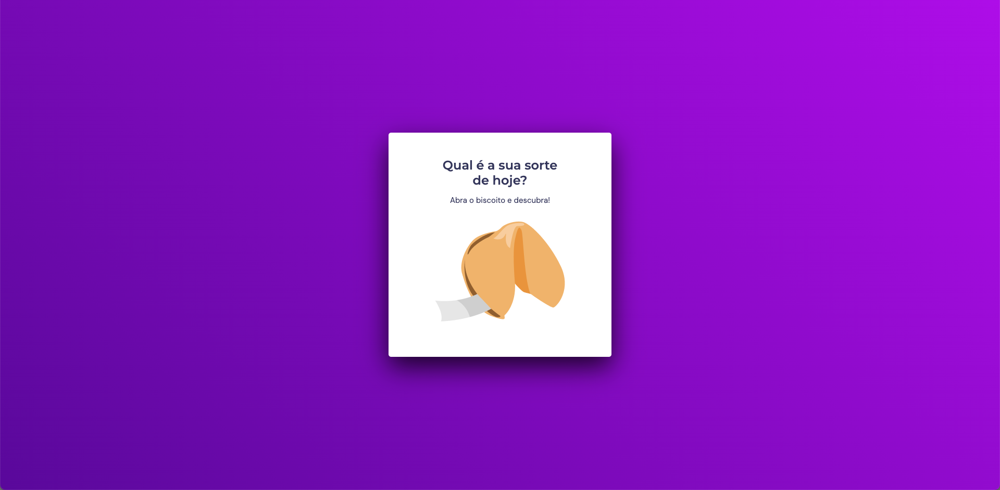
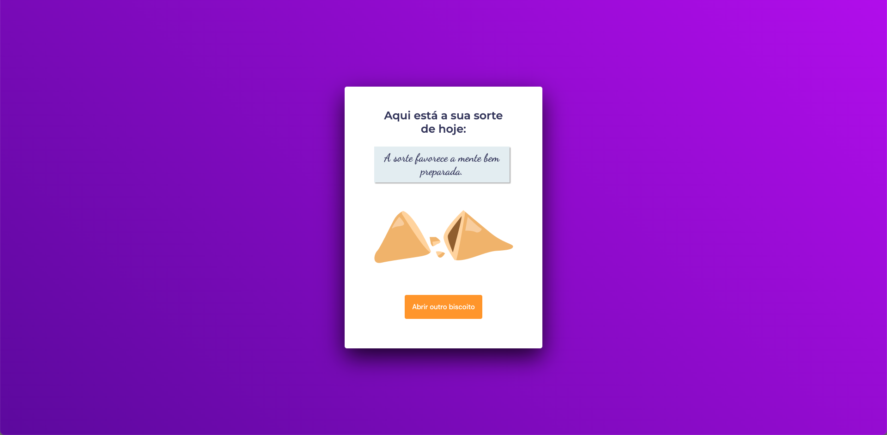

<h1 align="center"> Projeto Desafio - Biscoito da Sorte</h1>

Hora de se desafiar e colocar em prática o que foi ensinado na primeira fase do stage 05 e o que foi visto nos stages anteriores.

  <a href="#-tecnologias">Tecnologias</a>&nbsp;&nbsp;&nbsp;|&nbsp;&nbsp;&nbsp;
  <a href="#-projeto">Projeto</a>&nbsp;&nbsp;&nbsp;|&nbsp;&nbsp;&nbsp;
  <a href="#-layout">Layout</a>&nbsp;&nbsp;&nbsp;|&nbsp;&nbsp;&nbsp;

  

 

## 🚀 Tecnologias

Esse projeto foi desenvolvido com as seguintes tecnologias:

&nbsp;
&nbsp;
&nbsp;

## 💻 Projeto

É um projeto chamado Biscoito da Sorte, no qual o usuário, a partir de um clique ou enter, abre um biscoito com a sua sorte do dia.

## 🔖 Layout do projeto

 
 

 
 

Link do Figma:
 
https://efficient-sloth-d85.notion.site/Biscoito-da-Sorte-3ec5cf82a6dc41eb9672f21351a309b8

 

## Aprendizado

- Estrutura de dados HTML
- Animações com CSS
- Funções no Javascript
- Manipulação da DOM
- Biblioteca JS Math()
- Funções _callback_
- Arrays

 
 

🚀 by Paulo Henrique A. Stabelino.
